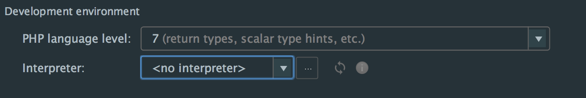
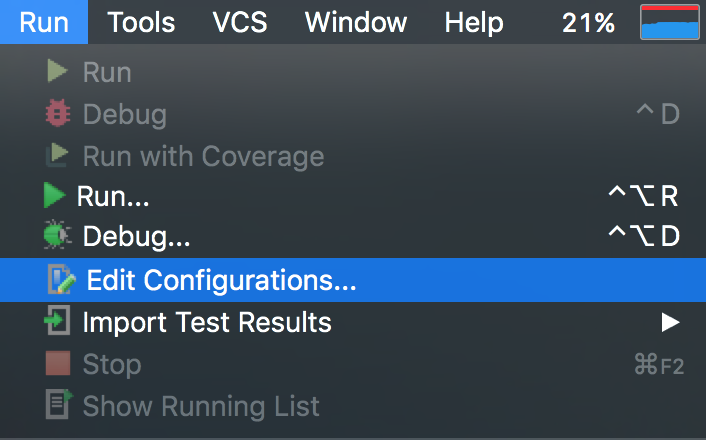
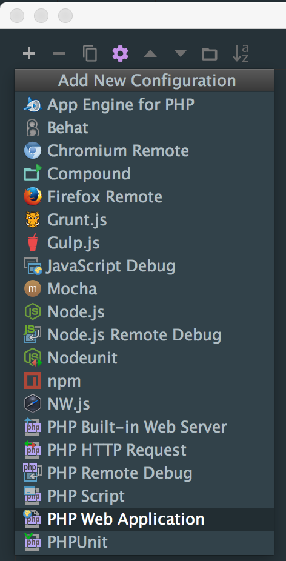
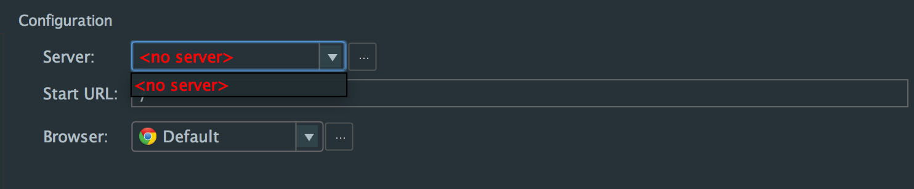
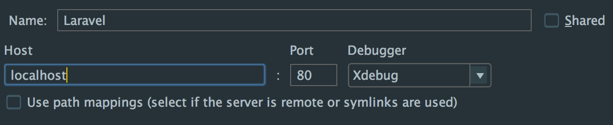
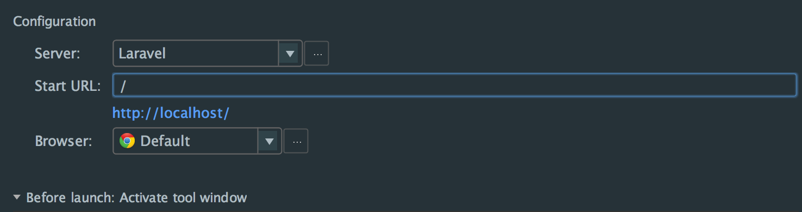
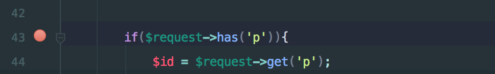

一般正常我們在Laravel Debug 時都會用

```dd()``` 或是 ```var_dump()``` 方法來進行 Debug

查看目前的變數裡面到底存什麼

當然這個方法非常直覺，想要看什麼，直接把那個變數帶進去就知道了

但當程式越來越複雜，你得把一個個商業邏輯都是抽得乾乾淨淨。可能你每次跑一個Controller Action 都要跑超過三四隻 php 檔，可能是 Service、Repository 檔案。

這時候你很容易忘記把 ```dd()``` 或是 ```var_dump()```加在哪裡。或是每次Debug都要，加```dd()```、刪```dd()```、加```dd()```、刪```dd()```、加```dd()```、刪```dd()```，一直重複寫這些code。

如果你有以上困擾，建議你開始使用 Xdebug。

首先先在你主機的php加上Xdebug，如果你是用 MAMP PRO 來開發的話，在 PHP 的標籤就可以直接打勾起來使用Xdebug了。

如果不是的話建議使用 Homebrew 來安裝。

```
brew install php<version number>-xdebug
```
例如我是 PHP 7.0版，就輸入

```
brew install php70-xdebug
```

全部安裝好後，輸入一下

```
php -v
```
看以下有沒有下面類似的字
	
```
with Xdebug v2.4.0RC2, Copyright (c) 2002-2015, by Derick Rethans
```

如果有就是安裝好了

> *小提醒：在使用 Composer 功能前（例如 composer update 、 composer install）輸入```php --ini```，找到目前吃到的 php.ini 檔，將下面這行前面加上```;```，把它註解掉，這樣 Composer 才不會跑太久～
> 
> ```
> zend_extension="/.../xdebug.so"
> ```
> 當然比較方便的做法是跑 composer 跟跑你專案的 php 是不一樣一個，像是你在 Homebrew 上裝 Xdebug，然後用 Mac 上原生 php 用來跑 Composer;或是你下載 MAMP 並在上面裝 Xdebug，然後一樣用 Mac 上原生 php 用來跑 Composer。注意兩個php版本盡量一致。
> 

安裝好後，你就可以透過 phpstorm 來 debug 了 ！
首先要先設定幾個東西

首先我們要來選定剛剛安裝好 Xdebug 的 PHP

先按快捷鍵 ``` Cmd（Ctrl） + , ```，打開設定

在 Languages & Frameworks 裡面找一下 PHP，不用展開裡面的內容，直接點一下，旁邊就會出現



按一下 intepreter 右邊的那個 ```...``` 的按鈕

進去後，將你可以執行的 php 的路徑貼在 PHP executable 那欄裡。

如果不知道你的PHP 在哪，可以在 Terminal 輸入 
	
	which php

> 如果加入了php 路徑，但phpstorm 還是沒有找到你有 Xdebug。
> 那代表你沒有正確安裝 Xdebug
> 可以輸入
> 
> ```
> php -v
> ```
>  
> 去檢查，或是輸入
> 
> ```
> php --ini
> ```
> 
> 去檢查那隻 loaded 的 ini 檔，裡面有沒有下面的設定
> 
> ```
> zend_extension=xdebug.so
> xdebug.remote_enable=1
> xdebug.remote_connect_back = 1
> xdebug.remote_port = 9000
> ```


接下來打開你的 phpstorm，在上面個工具列找到 ```Run``` 下面的 ```Edit Configurations```



打開後，按最左上角的 + ，然後滑到最下面選擇 ```PHP Web Application```



按完後，你會看到設定檔裡 Server 裡面什麼都沒有



這時候按 Server 那下拉式的選單旁邊的那個 ... 按紐，就會再開啟一個視窗

進去後一樣按左上角的 + ，再進一步去設定你的 Server 名稱

跟他的 ip，如果他架在 localhost 的話，Host 那個欄位就打 localhost



接著再按下面的 Apply 跟 OK 鍵，視窗就會自己關掉，並回到剛剛設定的地方。

這邊的 Start Url 是指每次打開網頁的啟示頁，通常是直接設定首頁，你再重首頁導去你要去的地方，但如果你現在只要測其中一頁的邏輯，你可以直接把連結改成你要測的地方。



接著再按下面的 Apply 跟 OK 鍵，視窗就會自己關掉，這樣就完成了。


要開始 Debug 時，只要到工具列選 ```Run``` 然後再點 ```Debug...```

選你剛剛創建的 Configuration

接下來你只要在 程式最左側的地方點一下，就會有個紅點點




接下來只要執行到這裡的邏輯時，頁面就會停住，回到phpstorm 上，下方就會出現所有有關的debug 資訊。

> 注意：執行測試後，瀏覽器會自動打開測試頁面，但他會在後面加上 ```XDEBUG_SESSION_START``` 為開頭的參數，如果這個後面的號碼跟 phpstorm 上面的不一樣，他就不會執行 XDebug。


參考資源：

1. http://confluence.jetbrains.com/display/PhpStorm/Xdebug+Installation+Guide
2. https://laracasts.com/series/how-to-be-awesome-in-phpstorm/episodes/20